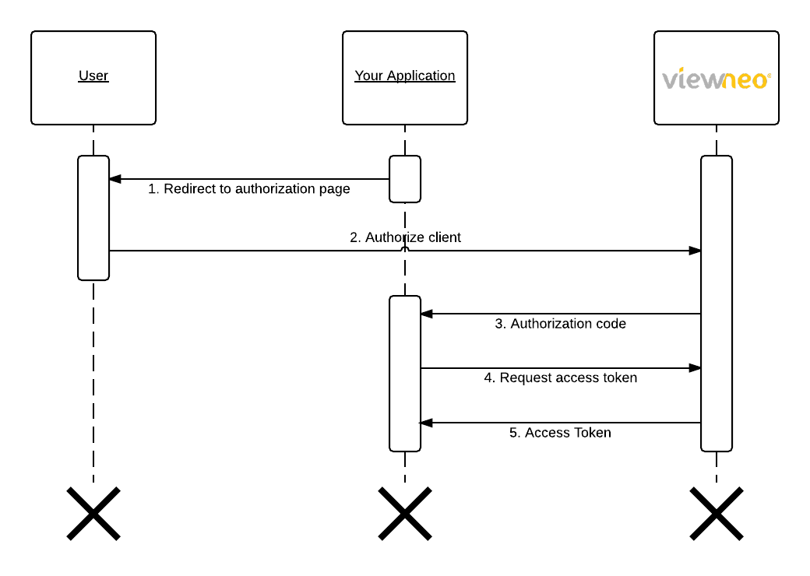

# viewneo-api

## About
[viewneo](https://www.viewneo.com/) is a proprietary, cloud-based Digital Signage Software. You can use viewneo in conjunction with our pre-designed templates or create your own content within minutes. Additionally, users can integrate dynamic content like homepages, Facebook posts, in addition to weather and news RSS feeds. Our **API** allows you to access the full functionality of viewneo and embed your own programs, such as booking systems, into viewneo. 

## Resources
- [Authorization](#authorization)
  * [Personal Access Token](#personal-access-token)
  * [OAuth2](#oauth2)
  * [Example Access Token Usage](#example-access-token-usage)
- [How-To Send Data](#how-to-send-data)
- [REST Endpoints](http://cloud.viewneo.com/doc/api)
- [Data Models **(Not completed yet)**](./models/)
- [Examples](./examples/)

## Authorization
To communicate with the viewneo API you must have a valid access token in the requests `Authorization` header.

### Personal Access Token
If you want to access the API in the name of your own account you should generate a personal access token. To generate a personal access token visit the [API Settings](https://cloud.viewneo.com/cms#/dashboard/api) in your viewneo account. Click on "**Generate new token**" and store it in a secure place. 

Personal access tokens are valid until you remove them in your API dashboard.

>**Important:** Treat your personal access tokens like passwords and never share them with anyone.

### OAuth2
To access the viewneo API on a users behalf you can use OAuth2 to get an **access token**. To use this feature you have to create an **OAuth client** in your viewneo API settings.



#### Get authorization code (1. - 3.)
To obtain an **authorization code**, the user has to authorize access to their account. 

In order to redirect the user to the authorization page, the first step is to first build the URL. Add the following key-value parameters as [query string](https://en.wikipedia.org/wiki/Query_string) to the base url `https://cloud.viewneo.com/oauth/authorize`.

| Key | Value |
| --- | --- |
| client_id | Id of your OAuth client |
| redirect_uri | '[Url encoded](https://en.wikipedia.org/wiki/Percent-encoding)' callback URL to redirect the user after authorization. **Important:** This value has to match the redirect url you set in your client settings |
| response_type | `code` |

A valid redirect URL will look similar to this: 
```
https://cloud.viewneo.com/oauth/authorize?client_id=9&redirect_uri=https%3A%2F%2Fexample.com%2Fcallback&response_type=code
```

This is how the authorization page will appear. 


Once the user has authorized your client, they will be redirected to the redirect URL. The **authorization code** will appear where the parameter `code` is located below. 

```
https://example.com/callback?code=AUTHORIZATION_CODE
```


#### Get the access token (4. - 5.)
When you got your **authorization code** it's time to request your access token.

Just send a `POST` request with the following JSON to the viewneo **OAuth token** url.

```
https://cloud.viewneo.com/oauth/token
```

Replace the capital values with your data.
```JSON
{
  "grant_type": "authorization_code",
  "client_id": "YOUR CLIENT ID",
  "client_secret": "YOUR CLIENT SECRET",
  "redirect_uri": "https://example.com/callback",
  "code": "YOUR AUTHORIZATION CODE"
}
```

Curl example:
```
curl -H "Content-Type: application/json" -X POST -d '{"grant_type": "authorization_code","client_id": "YOUR CLIENT ID","client_secret": "YOUR CLIENT SECRET","redirect_uri": "https://example.com/callback","code": "YOUR AUTHORIZATION CODE"}' https://cloud.viewneo.com/oauth/token
```


If everything is working properly it will look like this, otherwise, you will receive an error message outlining the problem. 
```JSON
{
  "token_type": "Bearer",
  "expires_in": 1296000,
  "access_token": "SOME ACCESS TOKEN",
  "refresh_token": "SOME REFRESH TOKEN"
}
```

#### Refresh expired token
If you want to refresh your access token before it expires. Just send the following JSON to the **OAuth token** url.

```
https://cloud.viewneo.com/oauth/token
```

Replace the capital values with your data.
```JSON
{
  "grant_type": "refresh_token",
  "refresh_token": "YOUR REFRESH TOKEN",
  "client_id": "YOUR CLIENT ID",
  "client_secret": "YOUR CLIENT SECRET",
}
```

Curl example:
```
curl -H "Content-Type: application/json" -X POST -d '{"grant_type": "refresh_token","refresh_token":"YOUR REFRESH TOKEN",client_id": "YOUR CLIENT ID","client_secret": "YOUR CLIENT SECRET"}' https://cloud.viewneo.com/oauth/token
```

### Example Access Token Usage
Once you have a valid access token, the following is a simple **curl** request with authorization that is designed to  [get all of the playlists](http://cloud.viewneo.com/doc/api#!/Playlist/api_playlist_index) associated with your account the access token. Just replace `YOUR_ACCESS_TOKEN` with a real one. 

```SHELL
curl -X GET -H 'Accept: application/json' -H 'Authorization: Bearer YOUR_ACCESS_TOKEN' 'https://cloud.viewneo.com/api/v1.0/playlist'
```

## How-To Send Data
Data sent to the viewneo API should normally be in JSON format. For example if you want to create a playlist the JSON would look like this:
```JSON
{"name":"My awesome playlist", "comment":"My awesome comment."}
```

Try the **curl** request:
```SHELL
curl -X POST -d '{"name":"My awesome playlist", "comment":"My awesome comment."}' -H 'Content-Type: application/json' -H 'Authorization: Bearer YOUR_ACCESS_TOKEN' 'https://cloud.viewneo.com/api/v1.0/playlist'
```

The response would look like this:
```JSON
{
    "name":"My awesome playlist",
    "comment":"My awesome comment.",
    "company_id":221,
    "updated_at":"2017-01-24 16:37:20",
    "created_at":"2017-01-24 16:37:20",
    "id":16047
}
```
