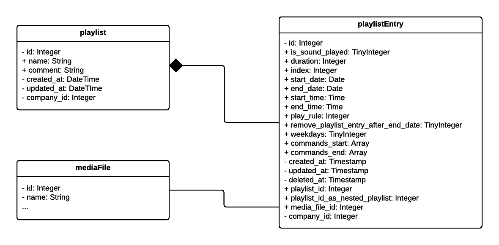

#Playlist Model
Contents to play on your devices are organized as [playlist entries](#playlistentry) in [playlists](#playlist).

##Playlist
###id: Integer
###name: String
###comment: String
###created_at: DateTime
###updated_at: DateTime
###company_id: Integer

##PlaylistEntry
###id: Integer
The id of the playlist entry is set by the system.

###index: Integer (Required)
The *index* describes the order of the playlist entries ascending. (Default: 0)

###duration: Integer (Required)
Duration of the played content in seconds. (Default: 0)

###is_sound_played: TinyInteger (Required)
Determines whether the sound of this content should be played.
- **0**: Never (Default)
- **1**: Always

###play_rule: Integer (Required)
When should the content be played?
- **0**: According to schedule
- **1**: Always (Default)
- **2**: Never

###start_date: Date
Content is played from this day on. Format `YYYY-MM-DD` (Default NULL)
>**Important:** To take effect of this setting [`play_rule`][play-rule] must go according to schedule

###end_date: Date
Content is played until this day. Format `YYYY-MM-DD` (Default NULL)
>**Important:** To take effect of this setting [`play_rule`][play-rule] must go according to schedule

###remove_playlist_entry_after_end_date: TinyInteger (Required)
Determines whether the playlist entry will be removed from the playlist after the specified end date.
- **0**: Don't remove (Default)
- **1**: Remove
>**Important:** To take effect of this setting [`play_rule`][play-rule] must go according to schedule and an [`end_date`](#end-date-date) must be specified

###start_time: Time
Content is played from the specified time. Format `HH:MM:SS` (Default NULL)
>**Important:** To take effect of this setting [`play_rule`][play-rule] must go according to schedule

###end_time: Time
Content is played until the specified time. Format `HH:MM:SS` (Default NULL)
>**Important:** To take effect of this setting [`play_rule`][play-rule] must go according to schedule

###created_at: Timestamp
Timestamp of the moment the playlist entry was created. This value is set by the system.

###updated_at: Timestamp
Timestamp of the moment the playlist entry was modified the last time. This value is set by the system.

###playlist_id: Integer (Required)
Id of the playlist this entry belongs to. 

###playlist_id_as_nested_playlist: Integer
Id of the playlist if this entry should be a nested playlist or NULL. (Default NULL)

###media_file_id: Integer
Id of the associated mediafile or NULL. (Default NULL)

###company_id: Integer
Id of the company that owns this playlist entry. This value is set by the system.

[play-rule]: #play_rule-integer